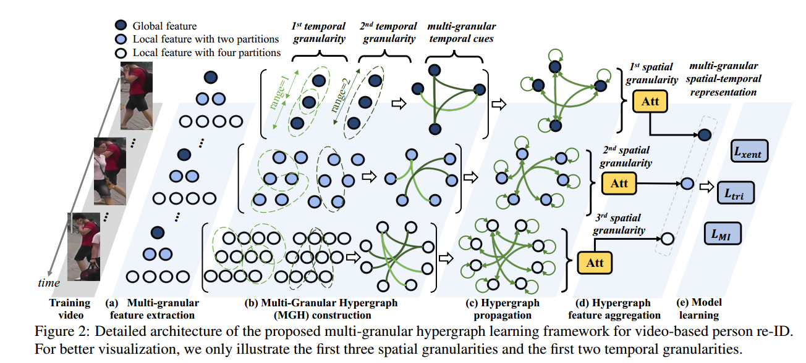

## 一.摘要
视频行人再识别是计算机视觉领域的一个重要研究主题.解决这个具有挑战性任务的关键在于:在视频序列中同时利用空间和时间线索.

在本文中,提出了一个新颖的基于图(Graph)的网络框架,多粒度超图(**Multi-Granular Hypergraph(MGH)**),通过在多个粒度
方面,对时空依赖性进行建模,来追求更好的表征能力.

具体地,在视频序列中,使用不同层次的部分特征(分part)来构建具有不同空间粒度的超图.
在每个超图中,连接跨不同时间范围的一系列图节点的**超边(hyperedges)**,捕获不同的时间粒度.
最后,通过互信息最小化(mutual information minimization),学习多粒度的更多样化图层次的表征,进一步增强整体的视频表征.

## 二.方法
结构如图所示

###2.1 多粒度特征提取
&emsp;给定一个图象序列$$c_k=\{x_t |x_t \in R^{H*W}\}_{t=1}^{N}$$